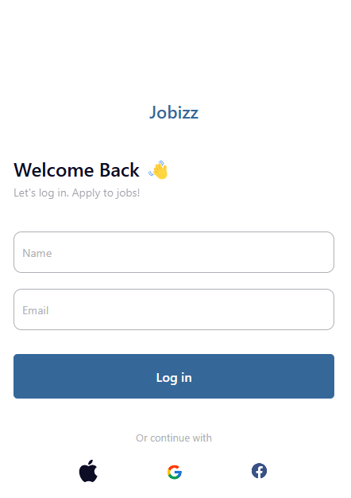
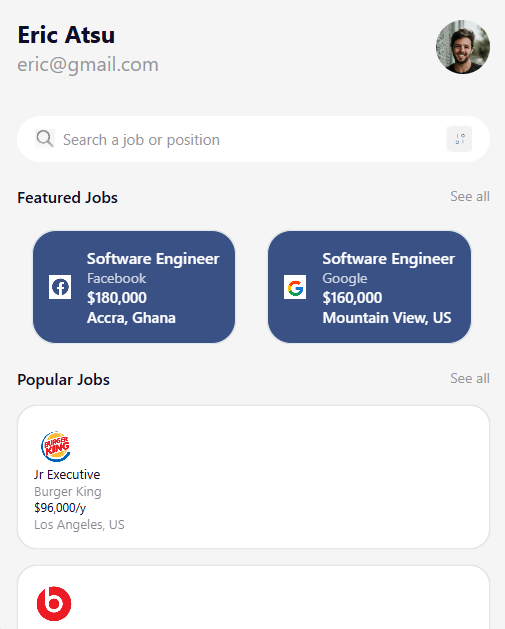

# Jobizz App

Jobizz is a React Native application that helps users apply for jobs easily.
 Components

1. LoginScreen

- Purpose: Allows users to log in using their name and email.
- Features:
  - Input fields for name and email.
  - "Log in" button to navigate to the Home screen.
  - Social media login options (Apple, Google, Facebook).
  - "Register" link for new users.

 2. HomeScreen

-The HomePage component is the main screen of the app. It displays the user's profile information, a search box to input job searches, featured job listings, and popular job listings.

Profile Information: Displays the user's name and email.
Search Box: Allows users to input job searches.
Featured Jobs: Displays a horizontal scrollable list of featured job listings.
Popular Jobs: Displays a vertical list of popular job listings.

 3. JobCard

- Purpose: Displays individual job details.
- Features:
  - Reusable component to show job title, company, etc.

Below are screenshots of the app:

